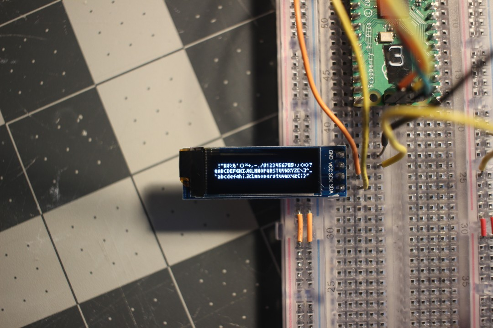

# Tiny Text
Low resolution bitmap font with a small memory footprint

Based on the "Tom Thumb" font, available under the CC0 license.  
https://robey.lag.net/2010/01/23/tiny-monospace-font.html

Tiny Text is a 5x3 bitmap font. This implementation supports drawing on any display with the HAL.Bitmap interface or an appropriate Set_Pixel procedure.

## Examples

- [examples/hal_bitmap_ssd1306](examples/hal_bitmap_ssd1306) uses the Tiny_Text with the HAL.Bitmap interface implemented by the SSD1306 driver from Ada_Drivers_Library.
- [examples/generic_oled](examples/generic_oled) uses an instantiation of the `Generic_Tiny_Text` package with a custom OLED driver's `Set_Pixel` procedure.
- [examples/native_raylib](examples/native_raylib) uses `Generic_Tiny_Text` with the [raylib](https://www.raylib.com/) graphics library for display on native platforms.

MIT License  
Copyright 2020-2024 Jeremy Grosser  
See LICENSE for details.  
